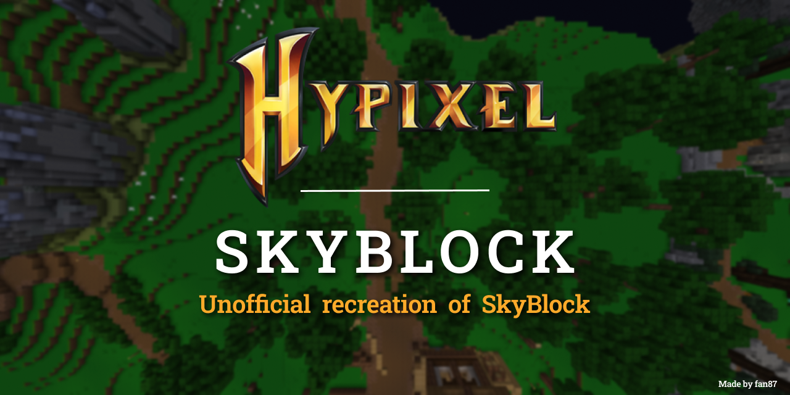

<!-- You shouldn't be editing this file! Edit `readme.raw.md` instead! -->


<!-- You shouldn't be editing this file! Edit `readme.raw.md` instead! -->


<!-- You shouldn't be editing this file! Edit `readme.raw.md` instead! -->


<!-- You shouldn't be editing this file! Edit `readme.raw.md` instead! -->


<!-- You shouldn't be editing this file! Edit `readme.raw.md` instead! -->


<!-- You shouldn't be editing this file! Edit `readme.raw.md` instead! -->


<!-- You shouldn't be editing this file! Edit `readme.raw.md` instead! -->


<!-- You shouldn't be editing this file! Edit `readme.raw.md` instead! -->


<!-- You shouldn't be editing this file! Edit `readme.raw.md` instead! -->


<!-- You shouldn't be editing this file! Edit `readme.raw.md` instead! -->



## Index

 - [Index](#index)
 - [Development](#development)
 -  - [Gradle](#gradle)
 -  - [File Structure](#file-structure)
 -  - [About Kotlin and Gradle - Why we use them](#about-kotlin-and-gradle---why-we-use-them)
 -  - [Vulnerabilities](#vulnerabilities)
 - [Contact](#contact)
 -  - [Discord](#discord)
 - [License](#license)


## Development

This project requires a lot of work, contributions are very welcome.

### Gradle
We are using Gradle for this project
(See [About Kotlin and Gradle - Why we use them](#about-kotlin-and-gradle---why-we-use-them)). It's recommend to use
Gradle Wrapper. If you would like to use Gradle on your local machine

### File Structure
[//]: # (Using `sh` for comments syntax highlight)

```sh
# File structure

.idea/ # Run configurations etc.
gradle/ # A directory for gradle wrapper
run/ # Where server runs. File structure inside run/ may change anytime
readme-assets/ # Assets for this file. For example: Banner

buildSrc/ # See https://docs.gradle.org/current/userguide/organizing_gradle_projects.html#sec:build_sources

plugin/ # Main Plugin

build.gradle.kts # Gradle build script. Using Kotlin DSL
gradlew # Gradle wrapper file for Unix-like operating systems
gradlew.bat # Gradle wrapper file for Windows
LICENSE # License information
readme.raw.md # Original readme file
readme.md # The file you are reading right now. (Generated by `generateReadMe` task)

.gitignore # For git
.gitattributes # For git
```

### About Kotlin and Gradle - Why we use them

If you are not fine with Gradle and Kotlin, then first, let's talk about them.

If you don't know Gradle already, it's a build script based build tool. Maven is also a build tool, but the difference
is that Maven uses a definition file, but gradle uses a programming language for it. So unlike maven, you can basically
do anything you want during build without having a plugin. It's also faster than Maven, and as fast as IntelliJ's
artifact build.

Since this project is going to be really complicated, and spending time on the build tool is worth doing, I'll be using
Gradle for this project. Now, let's talk about the language we use: Kotlin.

Still, using Kotlin to code large scaled project like this (especially Spigot plugins) is better than doing it in Java.
There are some features like Delegation, Operator Overloading, Extension Function that we don't have in Java. Having
them will make the code way cleaner, and makes your life easier. I mean, yes, of course you can do them in Java by doing
some workaround, but it makes the code very messy.

Some example:
```kt
class SBPlayer(val originalPlayer: Player): Player by player {
    
    fun someMagicFunction() {
        this.sendMessage("Hello, World!") // SBPlayer is basically implementing Player class, but actually proxied
        // method calls to the `originalPlayer` variable
    }
    
}
```
> Delegation allows you to have stuff like this. I mean this is probably not what it was made for, but using it makes
> your life way easier.

I hope you now get why we use Gradle and Kotlin now: It makes our life easier, and makes the code cleaner (if you
understand Kotlin).

### Vulnerabilities
If you have found any following kind of vulnerabilities, please [contact](#contact) us as soon as 
possible, so we can prevent people from getting attacked!

 - Server Crashing Exploit
 - Remote Code Execution
 - Database Write/Read Leak
 - In-Game Privilege Escalation (For example: Force OP)
 - Code Injection
 - In-Game Item Duplication

> ⚠️ Do not open a GitHub issue for it if you have found any vulnerability! Please contact us directly,
> and we'll publish a patch as soon as possible

## Contact
If you need a support, you can contact us on Discord, and get a response fast.

### Discord

> ⚠️ While it's in development state, you SHOULD NOT ask something like "How to use", "How to setup".
> You should only be opening tickets for bug report, contribution, etc.  Please read the Discord
> [`#readme`](https://discord.com/channels/964644300908531713/964644301491548162)
> channel before opening a ticket


Direct Messaging us most likely won't work (I'm getting like 10 friend request every day, and now I'm
just ignoring most of them). Please join our support [Discord Server](https://discord.gg/DTTV5uWewD)
and open a ticket.

`fan87#5283` - Head Developer<br>
`TropicalFan344#2076` - Head Developer


## License
Please check [`LICENSE`](LICENSE) for more information.

<!-- You shouldn't be editing this file! Edit `readme.raw.md` instead! -->


<!-- You shouldn't be editing this file! Edit `readme.raw.md` instead! -->


<!-- You shouldn't be editing this file! Edit `readme.raw.md` instead! -->


<!-- You shouldn't be editing this file! Edit `readme.raw.md` instead! -->


<!-- You shouldn't be editing this file! Edit `readme.raw.md` instead! -->


<!-- You shouldn't be editing this file! Edit `readme.raw.md` instead! -->


<!-- You shouldn't be editing this file! Edit `readme.raw.md` instead! -->


<!-- You shouldn't be editing this file! Edit `readme.raw.md` instead! -->


<!-- You shouldn't be editing this file! Edit `readme.raw.md` instead! -->


<!-- You shouldn't be editing this file! Edit `readme.raw.md` instead! -->
